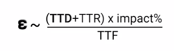

# Site Reliability Engineering

## CRE
CRE - Costumer Reliability Engineering
Costumers need to know your SLO's to know what to expect from your service.
If they know your SLO's they can properly calculate theirs.
This communication can remove some friction between you and your costumers

It's good to note that Users decide the reliability on the end.

To calculate what is your "time to repair an error" we can take the reliability percentage and multiply by a certain amount of time.

Ex: 99.9% means that we will have 40 minutes repair time on a 28-day period

With this we can see that, by adding just another 9, our time to repair becomes a lot lower (4 min).

## SLOs for business

SLO's - service level objective

it can answer to the business when it should prioritize it over new features.
The right rate of reliability is based on your users.

SLO's can change based on different events. FOr example, on a black friday the e-commerce might want to have a higher SLO to not lose any sell. So the SLO is higher just on this specific time.  
It's good to note that we can not have 100% reliability. This percentage should be ambitious but achievable. And the SLO's should be consistently reviewed 

## SLOs and SLAS

SLAs - service level agreement, is the agreement between the org and the user about you service reliability. If those are violate, it will have monetary consequences.

So, the best practice is to define a higher SLO (that is an internal metric) to never get on a point where a SLA is violated.

When the SLO's starts to be violated, we should hold up new features to fix this issues.

## Measuring Reliability

SLI - service level indicators. Define metrics to quantify reliability of your system. This should be used to calculate SLO's and SLA's

## Error budget

Error budget is basically the opposite of SLO. It's the percentage that you have to spare with errors before your slo's is violated. This is a good metrics to the SRE teams to hold up new features or not.

Developers can self-regulate and manage risk better with error budgets, it helps to balance development velocity and reliability.

There is a good techniques that can be applied when there are no more error budget but the dev team still need to release a new feature. We can give a set of tokens to senior developers that can be used to roll out something even when the SLO is violated. So, only a critical and very high priority bug needs to be fixed is that it wil be able to go to prod when there is no error budget.

Also, error budget alerts are very good to maintain everyone knowing who the system is performing.

## Setting targets for reliability

Your error rate is proportional to those variables: 
* TTD - time to detect
* TTR - time to resolution
* impact - percentage of your impacted users
* TTF - time to failure (how frequent the failure occurs) same as TBF

1. Lower the TDD - pings a human instead of requiring manual investigation to see if there is a failure or monitoring your SLO's complaints.

2. Improve TTR - develop a playbook or change the zone automatically when there is a failure so you have time to fix the bug

3. Reduce impact - limit the number of users that receives a change on certain amount of time

# Measuring and Managing reliability
A good SLI has a predictable relationship with the happiness of your users (and that is the problem). it should also show that service is working as the user expect and should be aggregated over a long time horizon. Maybe cpu, memory and RAM or HW related metrics are not a good thing to have as SLI's since it do not correlate directly with the user experience being good or bad. 

It's also a good thing that the SLI should not be derivative a lot, it should be more constant and have less "peeks and valleys".

Some ways of measuring SLI's:
* Request Logs - use the request logs to get good and bad requests
* Application Metrics
* front-end infra metrics
* Synthetic clients - get the metrics from a synthetic client running some "common" steps. 

SLI should be related by the ratio of good event and valid events (sometimes you need to remove some invalid events of your data that should not consume the error budget). This is good because it represents a percentage, makes the number more consistency leading to a easier tooling build.

Some useful metrics:
*  Request / Response:
    * Availability - the proportion of valid requests served successfully. The definition of success can vary depending of the system. Maybe using the HTTP codes as signifier of success can be problematic since the response contents might not match the status code.
    * Latency - the proportion of valid requests served faster than a threshold. It's nice to have a range also of SLO, since it can vary
    * Quality - IF your system has a mechanism to trade off quality of the response returned for your user with something else such as CPU or memory, youu should track this. Proportion of valid requests served without degrading quality. Examples: Returning results after searching only a subset of data to save CPU cycles when overloaded; Serving stale data from cache because the database is overloaded.

* Data Processing:
    * Freshness - the proportion of valid data updated more recently than a threshold. The user always expect that he receives the latest and updated data and we should check this. On a batch processing case, it can be related to the time since the completion of the processing and the availability of the data and for that we need a "source age timestamp".
    * Correctness - the proportion of valid data producing correct output. The methods that you use to define the correctness of the data should be separated to the one from the software that you are building. It might be good also to define golden input and the expected output, but those should be pretty representative of what the user does when using the system and it should use a lot of the "conditionals" that the system has.
    * Coverage - the proportion of valid data processed successfully. We should count the valid input records and then compare this with the processed ones (the good events).
    * Throughput - the proportion of time where the data processing rate is faster than a threshold. We should define the event as a passage of time, i.e., a minute, 30 seconds, etc, and a good event is when the process rate on this time was good enough. We can also use the bytes/s metric since the size of the processing data can interfere on the processed events throughput for example.

Is good to maintain just 1-3 SLI's for each user journey. You will probably need a lot of metrics to help you figure out what is broken, but is nice to have few SLi's to define if something is broken or not. We can manage complexity aggregating similar SLI's from different journeys. We can sum up the SLi's from different journeys into a single SLI response that tells me an overall quality of all of those.

*bucketing* -> We can mange complexity also by bucketing things like latency threshold. Like set threshold for "background tasks" more relaxed about the time that it takes since it do not interferes with the user experience. Another good bucket to create is for a "write" request, when we need to mutate something on our db. One more is the "interactive" bucket, where we can use this for most used requests that should be as quick as possible.

## Setting and iterating on SLO targets
"User expectations are strongly tied to past performance". By analyzing historical data you can set a threshold that is achievable and good for the users. It's ok to wait and gather info before setting SLO's. 

The bad thing of using historical data to gather your SLO is that we assume that the user is happy with your system right now. We should have aspirational SLO's as a thing to be the "good state", and if the users are not happy with that, we should change those to a more restrainable one.

We should keep a continuos improvement on our SLO's. So keep asking for our costumers if they are happy with the system performance is key to understand if your SLO's are right.
